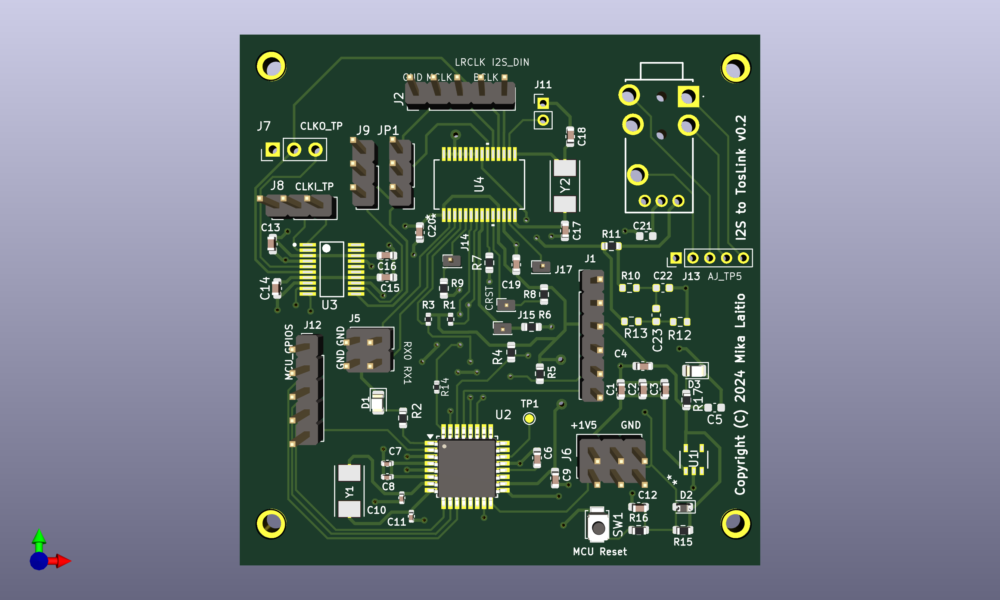

I2S to Toslink PCB

Kicad 7.0 schematic and PCB project for PCB that
can generate optical AES/EBU signal for Toslink audio adapter. PCB uses the
WM8805 chipset as a codec for transforming the signal from I2S to AES/EBU Toslink.

 

PCB has following input pins:
- 5V power
- GND
- I2S data
- I2S LRCLK
- I2S BCLK
- I2S MCLK (optional)

PCB can either be configured to use the external MCLK or generate the MCLK from the BCLK.
Generation of MCLK is usually needed because the WM8805 does not always work with the external
MCLK and that is hearable as a small errors and cracks on audio.

Project will also need the firmware for ATmega chip so that it can configure the PLL generator
and WM8805 over I2C lines to right mode.

By default the WM8805 codec GPO0 and GPO7 are pulled down so that the WM8805 is configured to use 16 bit I2S data.
But those gpio's can be pulled also to UP to 3V3 voltage to configure the WM8805 to handle 24 bit I2S data if needed.
(see wm8805 docs for details). Codec can also be resetted externally via reset pin. (ATmega has free gpios with headers to drive those pins if you want to add the jumper wires and modify firmware)

[Schematics in PDF document](./docs/schematics/schematics.pdf)
